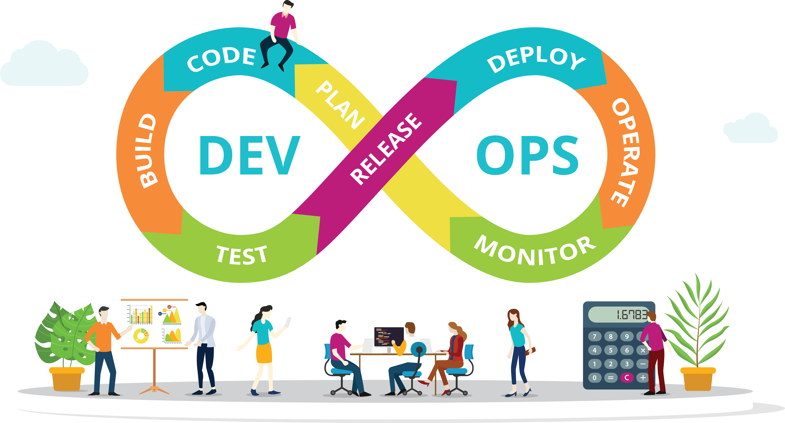
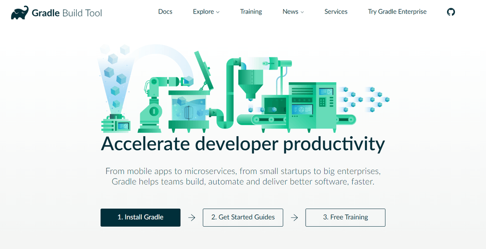
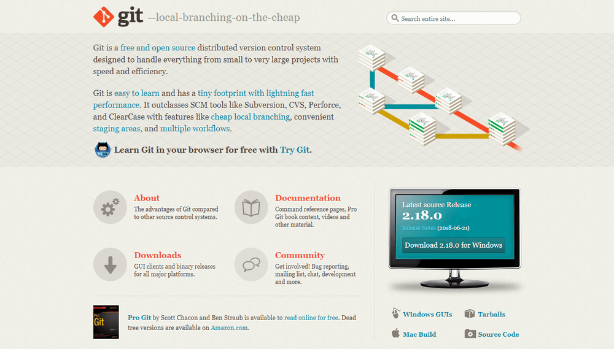
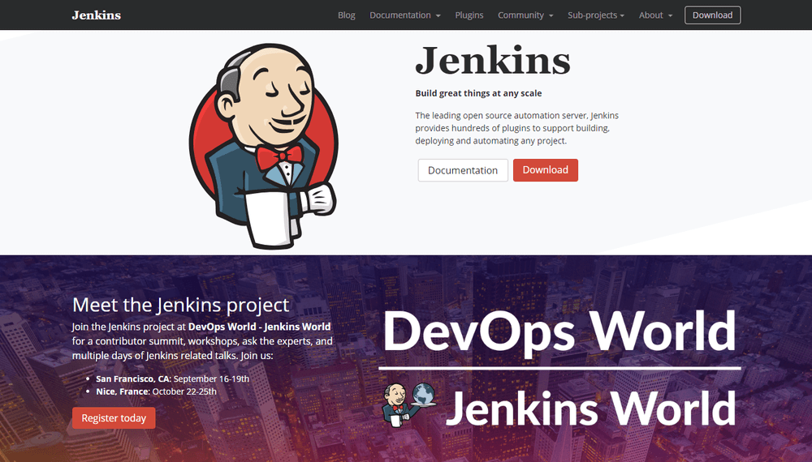
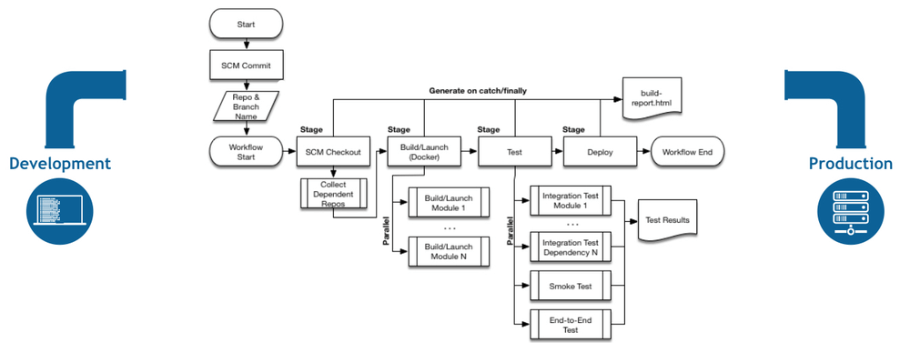
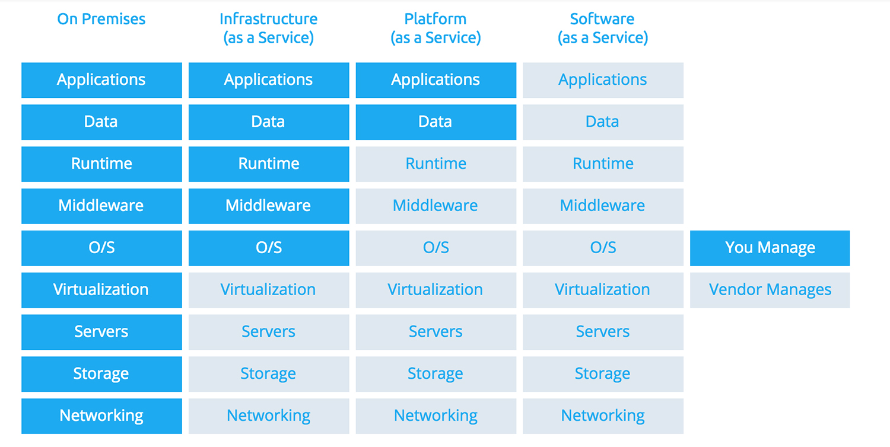

# What is DevOps

* DevOps represents a group of concepts that have catalyzed into a movement and are rapidly spreading throughout the technical community.
* DevOps is considered to be a collaboration between development teams and operations teams throughout the stages of the development lifecycle when creating and operating a service.
* Devops can be seen as the bridge that links development to operations.

### 3 Primary Practice Areas of DevOps

	- **Infrastructure Automation** = When you create your systems, OS configures and app deployments as code.
	- **Continuous Delivery** = When you build, test and deploy
	- **Site Reliability Engineering** = When you Operate your systems; monitoring, orchestration and also when designing for operability in the first place.

## Why DevOps - benefits to the business

### Technical Benefits:
* Continuous Delivery
* Faster resolution to problems
* Transparent and Agile way of working

### Cultural Benefits:
* Better communication between devs and ops
* Greateer professional development opportunities (less focused on specialisation)

### Business Benefits:
* Faster delivery of features
* More stable and sustainable operating environments
* Improved communication
* More time to innovate, rather than maintain, due to automated checks ensuring issues arent brought forward to the client.

## Tools of Devops

Here are some of the most popular devops tools:

1. **Gradle** 

This is considered to be a build tool. Apache Ant and Maven dominated the automated build tools for many years. However, from 2009, it gained more popularity and has steadily grown since then. Gradle allows you to write code in Java, C++, Python and many more languages. It is supported by a number of popular IDEs. One of the most notable things about Gradle is the fact that it has incremental builds as they save a reasonable amount of compile time. Gradle allows faster shipping and comes with a lot of configuration possibilities.

2. **Git**

Git is one of the most popular tools in DevOps and is widely used amoung the software industry. It is a Source Code Management tool (SCM) that is very useful for remote teams and open source contributors. Git allows you to track the progress of your development work. You can save different versions of your source code and return to a previous version when neccessary. You can also create separate branches and merge new features when they are ready to go. You can integrate Git with your DevOps workflow by hosting repositories where your team members can push their work.

3. Jenkins

Jenkins is the go-to DevOps automation tool for many software development teams. It is an open source CI/CD server that allows you to automate the different stages in your delivery pipeline. The mian reason for it's popularity is its huge plugin ecosystem meaning it can integrate with almost all DevOps tools, from Docker to Puppet. With Jenkins, you can set up and customize your CI/CD pipeline according to your own needs.

With Jenkins, you vcan iterate and deploy new code as quickly as possible. It also allows you to measure the success of each step of your pipeline.

## Cloud Computing

Cloud computing is the delivery of computer services online whether it is servers, storages, databases or networking. It allows companies to only pay for the services they utilise rather than having to constantly upscale and downscale their own system. The most popular cloud computing provider is Amazon who provide the "Amazon Web Services" or "AWS".

## What is SAAS, PAAS, IAAS?

### SAAS

This stands for Software as a Service. This type of cloud computing delivers applications over the internet through the browser. An Example of this is Office 365 or Dropbox. Typical SAAS applications offer extensive configuration options as well as development environments that enable customers to code their own modifications and additions.

### PAAS

This stands for Platform as a Service. It is similar to SAAS and it gives the ability to rent a development and deployment environment in the cloud. This allows you to avoid paying for software licenses etc. Instead, you can rent when you need to.

### IAAS

This stands for Infrastructure as a Service. It allows the user to use servers, storage and other infrastructure whenever they need to without having to pay upfront.

## When Should We Use PAAS, SAAS, IAAS and why?

* When we want to reduce upfront investment
* When a project's storage and processing requirements are unclear.
* When there is a possibility of a project being discontinued, and it is unclear whether a large investment in software or hardware will bring back a positve Return Of Investment.

## What is on prem/localhost - Hybrid and Public Cloud

### On Prem/LocalHost

On premises or localhost refers to when you use software or computing services on site or on your own computer. Localhost refers to the specific server that is ran by your computer.

### Hybrid Cloud

A hybrid cloud is a type of cloud computing that combines on premises infrastructure (private cloud) with a public cloud. It allows data and apps to move between the two environments.

**Benefits:**

* Greater Flexibility
* More Deployment Options
* Security
* Compliance
